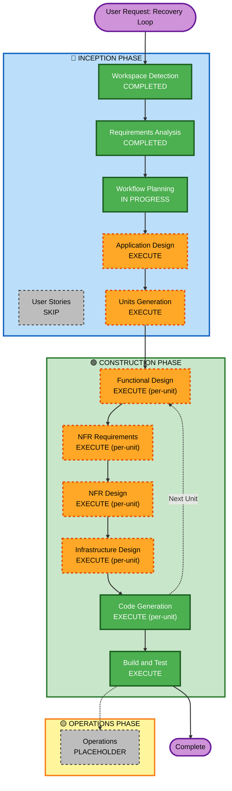

# Recovery Loop — Execution Plan

## Detailed Analysis Summary

### Change Impact Assessment
- **User-facing changes**: Yes — brand new SPA frontend with split-screen layout, SSE streaming, session resume
- **Structural changes**: Yes — entirely new multi-service architecture (API GW + Lambda + DynamoDB + Bedrock + E2B + S3/CloudFront)
- **Data model changes**: Yes — new DynamoDB table `RecoverySessions` with TTL and session schema
- **API changes**: Yes — new REST/SSE API surface (POST /sessions, SSE /sessions/stream)
- **NFR impact**: Yes — security (least-privilege IAM, Secrets Manager, input validation, HTTP headers), resiliency (explicit timeouts, agentic retry, structured logging, CloudWatch alarms)

### Risk Assessment
- **Risk Level**: Medium-High
- **Rationale**: Multi-service cloud-native stack with external dependencies (E2B, Bedrock), streaming architecture (SSE), agentic retry loop. Well-contained scope (developer tool, no PII, ephemeral sessions) lowers blast radius.
- **Rollback Complexity**: Moderate — SAM CloudFormation stack can be rolled back; frontend is stateless S3 deploy
- **Testing Complexity**: Moderate — unit tests for pure functions, integration tests for Lambda↔DynamoDB↔Bedrock↔E2B chain

---

## Workflow Visualization



### Text Alternative

```
INCEPTION PHASE:
  [x] Workspace Detection      — COMPLETED
  [x] Requirements Analysis    — COMPLETED
  [ ] User Stories             — SKIP (technical MVP, no multi-persona UX work needed)
  [x] Workflow Planning        — IN PROGRESS
  [ ] Application Design       — EXECUTE
  [ ] Units Generation         — EXECUTE

CONSTRUCTION PHASE (per-unit loop):
  [ ] Functional Design        — EXECUTE (agentic loop, session management, prompt construction)
  [ ] NFR Requirements         — EXECUTE (security, performance, scalability)
  [ ] NFR Design               — EXECUTE (security patterns, timeouts, circuit breaking)
  [ ] Infrastructure Design    — EXECUTE (SAM, DynamoDB, S3+CloudFront, API GW)
  [ ] Code Generation          — EXECUTE (always)
  [ ] Build and Test           — EXECUTE (always)

OPERATIONS PHASE:
  [ ] Operations               — PLACEHOLDER
```

---

## Phases to Execute

### 🔵 INCEPTION PHASE
- [x] Workspace Detection — COMPLETED
- [x] Requirements Analysis — COMPLETED
- [ ] User Stories — **SKIP**
  - *Rationale*: Technical MVP for developers; requirements specify exact functional behavior; no user personas, user journeys, or acceptance-criteria work that stories would add over the detailed requirements already captured
- [x] Workflow Planning — IN PROGRESS
- [ ] Application Design — **EXECUTE**
  - *Rationale*: Entirely new multi-component system. Need to define component boundaries (frontend app, Lambda orchestrator, session service, Bedrock service, sandbox service, infrastructure), their methods, and service-layer orchestration before decomposing into units
- [ ] Units Generation — **EXECUTE**
  - *Rationale*: System has multiple distinct logical units: (1) Infrastructure / SAM stack, (2) Backend Lambda service, (3) Frontend Svelte app. These can be developed in parallel after dependencies are mapped

### 🟢 CONSTRUCTION PHASE (per-unit)
- [ ] Functional Design — **EXECUTE** (per unit)
  - *Rationale*: Non-trivial business logic in the agentic retry loop, session state machine, Bedrock prompt construction, and E2B result parsing; needs explicit design before code generation
- [ ] NFR Requirements — **EXECUTE** (per unit)
  - *Rationale*: Security baseline and resiliency baseline are both enabled and blocking; tech stack selection (Node.js 20, TypeScript 5, Svelte 4, fast-check for PBT) needs to be formally recorded
- [ ] NFR Design — **EXECUTE** (per unit)
  - *Rationale*: Security patterns (Secrets Manager, input validation, HTTP headers, least-privilege IAM), resiliency patterns (explicit timeouts, CloudWatch alarms, structured logging) need design artifacts before code generation
- [ ] Infrastructure Design — **EXECUTE** (per unit)
  - *Rationale*: SAM template, DynamoDB table design, CloudFront+S3 distribution, API Gateway config, Lambda concurrency limits, and CloudWatch alarms all need to be mapped to actual AWS resource definitions
- [ ] Code Generation — **EXECUTE** (always, per unit)
- [ ] Build and Test — **EXECUTE** (always)

### 🟡 OPERATIONS PHASE
- [ ] Operations — **PLACEHOLDER** (future deployment and monitoring workflows)

---

## Proposed Unit Decomposition (preliminary — confirmed in Units Generation)

| Unit | Description | Key Artifacts |
|---|---|---|
| **Unit 1: Infrastructure** | SAM template, DynamoDB, API GW, S3, CloudFront, IAM | `template.yaml`, CloudFormation config |
| **Unit 2: Backend Lambda** | TypeScript Lambda handler + modules (session, prompt, bedrock, sandbox) | `src/handler.ts`, `src/session.ts`, `src/prompt.ts`, `src/bedrock.ts`, `src/sandbox.ts` |
| **Unit 3: Frontend** | Svelte + Vite SPA with SSE client, split-screen layout | `frontend/src/App.svelte`, `frontend/src/lib/api.ts` |

**Dependency order**: Unit 1 (Infrastructure) → Unit 2 (Backend Lambda) → Unit 3 (Frontend)

---

## Success Criteria
- **Primary Goal**: Production-ready MVP of Recovery Loop deployed to AWS us-east-1
- **Key Deliverables**:
  - `template.yaml` — SAM stack (DynamoDB, API GW, Lambda, S3, CloudFront)
  - `src/` — TypeScript Lambda with handler + 4 focused modules
  - `frontend/` — Svelte + Vite SPA with SSE streaming
  - `README.md` — local dev + sam deploy instructions
  - Test suite (Jest + fast-check for PBT on pure functions)
- **Quality Gates**:
  - All SECURITY rules compliant (blocking)
  - All RESILIENCY rules compliant or N/A (blocking)
  - PBT round-trip and invariant tests passing (partial mode)
  - `sam build` succeeds
  - `npm run build` for frontend succeeds

---

## Estimated Timeline
- **Total Stages to Execute**: 8 (Application Design, Units Generation, then per-unit: Functional Design × 3, NFR Requirements × 3, NFR Design × 3, Infrastructure Design × 3, Code Generation × 3, Build and Test × 1)
- **Estimated Sessions**: 8–12 interaction sessions depending on change requests
